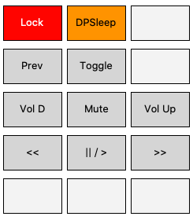
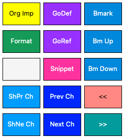

# Duckypad Profiles

Custom key profiles for the [duckyPad](https://github.com/dekuNukem/duckyPad) macro keypad.

## Usage

Rename each profile you want to use to change the `x` in `profilex` to be the profile number you'd like to use.

Follow the [instructions](https://github.com/dekuNukem/duckyPad/blob/master/manual_setup.md) for copying profiles onto the duckyPad.

## Profiles

### Mac OS X

Profile: `profilex_OS X`

Basic macros for OS X.

### Resize windows: Mac OS X

Profile: `profilex_Resize`

Resize windows to fill a proportion of the screen. Requires the free [Rectangle](https://rectangleapp.com/) to be running, and uses the default keybindings.

### Evil Genius 2

Profile: `profilex_EvGen 2`

Hotkeys for [Evil Genius 2](https://evilgeniusgame.com/en)

### Visual Studio Code: Mac OS X

Profile: `profilex_VSCode`

Hotkeys for [Visual Studio Code](https://code.visualstudio.com/)

Requires the Bookmarks extension, and includes a Python-specific import organisation shortcut.

Check that shortcuts match the Duckyscript and adjust the shortcut or Duckyscript as appropriate.

